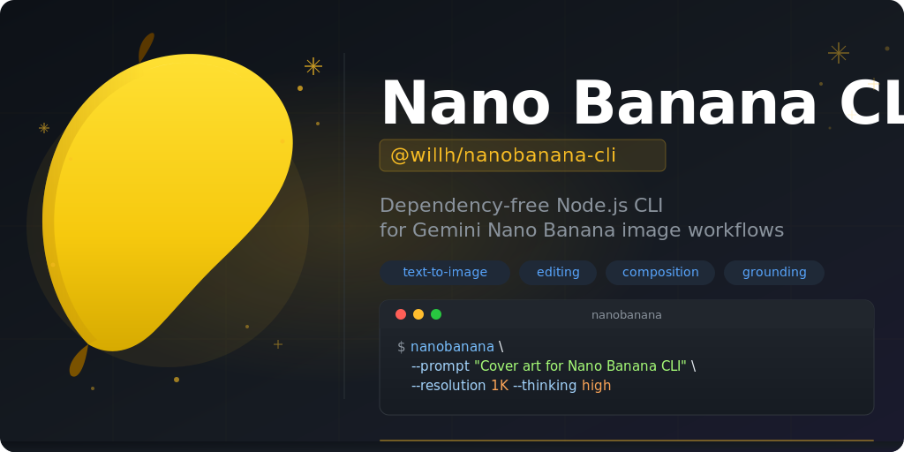

# Nano Banana CLI



`@willh/nanobanana-cli` is a dependency-free Node.js CLI for Gemini Nano Banana image workflows:

- text-to-image
- image editing with references
- multi-image composition
- optional Google Search grounding
- configurable thinking, aspect ratio, and output size

The repository also contains the matching agent skill at `skills/nanobanana-cli/SKILL.md`.

## Install

Recommended runtime:

- Node.js 22+
- npm latest
- Gemini API key in `NANOBANANA_GEMINI_API_KEY` or fallback `GEMINI_API_KEY`

Run without installing:

```powershell
$env:NANOBANANA_GEMINI_API_KEY="YOUR_KEY"
npx @willh/nanobanana-cli --prompt "A banana astronaut in space, cinematic lighting"
```

Install globally:

```powershell
npm install --global @willh/nanobanana-cli
nanobanana --help
```

## Usage

Basic generation:

```powershell
$env:NANOBANANA_GEMINI_API_KEY="YOUR_KEY"
nanobanana --prompt "A banana astronaut in space, cinematic lighting"
```

Generate with multiple references:

```powershell
nanobanana `
  --prompt "Create an ecommerce hero shot from these references" `
  -i .\ref1.png -i .\ref2.jpg
```

Specify render controls:

```powershell
nanobanana `
  --prompt "Flat illustration of a weather dashboard" `
  --aspect-ratio 16:9 `
  --resolution 2K `
  --thinking medium `
  --output-mode both `
  --output-dir .\out
```

Enable Google Search grounding:

```powershell
nanobanana `
  --prompt "Create a visual summary of this week's weather in San Francisco" `
  --google-search
```

Use `npx` directly:

```powershell
npx @willh/nanobanana-cli --prompt "Minimal product poster with warm studio lighting"
```

Generated files are saved to `nanobanana-output/` by default.

## CLI Options

- `-p, --prompt <text>`: prompt text
- `-i, --image <path>`: reference image path, repeatable up to 14 images
- `--images <p1,p2,...>`: comma-separated reference image paths
- `--model <name>`: model name, default `gemini-3.1-flash-image-preview` or `NANOBANANA_MODEL`
- `--thinking <level>`: `minimal`, `low`, `medium`, `high`
- `--aspect-ratio <ratio>`: for example `1:1`, `16:9`, `5:4`, `Auto`
- `--resolution <size>`: `512`, `512px`, `1K`, `2K`, `4K`
- `--output-mode <mode>`: `images` or `both`
- `--google-search`: enable Google Search grounding
- `--output-dir <dir>`: output directory
- `--api-key <key>`: override `NANOBANANA_GEMINI_API_KEY` or `GEMINI_API_KEY`
- `--name-prefix <prefix>`: output file prefix
- `-h, --help`: print help

## Defaults

- Default model: `gemini-3.1-flash-image-preview`
- Model env override: `NANOBANANA_MODEL`
- Default thinking: `high`
- Default aspect ratio: `Auto`
- Default resolution: `1K`
- Default output mode: `images`
- Default output directory: `nanobanana-output/`
- Max reference images: `14`
- `512px` requests are sent as string `"512"` to match Gemini API requirements

## Publish And Release

This repo is set up for automated release management with `release-please` and automated npm publishing through Trusted Publishing.

### One-time setup

1. Create the npm package `@willh/nanobanana-cli` under the target npm org/user.
2. In npm package settings, add a Trusted Publisher for this GitHub repository:
   - Repository: `doggy8088/nanobanana-cli`
   - Workflow file: `.github/workflows/publish.yml`
   - Environment: not required
3. Ensure GitHub Actions is enabled on the repository.

### Day-to-day release flow

1. Merge changes into `main`.
2. `Release Please` opens or updates a release PR based on conventional commits.
3. Merge the release PR.
4. `Release Please` creates the GitHub Release and tag.
5. The `Publish to npm` workflow runs on `release.published` and executes:
   - Node.js 22
   - `npm install --global npm@latest`
   - `npm ci`
   - `npm test`
   - `npm publish --provenance --access public`

### Commit format

Use conventional commits so `release-please` can calculate version bumps:

```text
feat: add support for google search grounding
fix: validate missing prompt before API request
docs: update trusted publishing instructions
```

## CI

GitHub Actions includes:

- `CI`: runs on push and pull request with Node 22, upgrades npm to latest, then runs `npm ci` and `npm test`
- `Release Please`: manages release PRs, changelog updates, tags, and GitHub Releases
- `Publish to npm`: publishes to npm with OIDC Trusted Publishing and provenance

## Repository Layout

- `skills/nanobanana-cli/SKILL.md`: skill instructions and operating defaults
- `bin/nanobanana.js`: published `nanobanana` binary wrapper
- `skills/nanobanana-cli/scripts/nanobanana-cli.js`: main CLI implementation
- `skills/nanobanana-cli/references/image-generation-api.md`: detailed API behavior and payload rules
- `skills/nanobanana-cli/references/sources.md`: source provenance

## Local Verification

```powershell
npm install --global npm@latest
npm ci
npm test
npx @willh/nanobanana-cli --help
```

## References

- [Image generation reference](skills/nanobanana-cli/references/image-generation-api.md)
- [Source notes](skills/nanobanana-cli/references/sources.md)
- [Gemini image generation docs](https://ai.google.dev/gemini-api/docs/image-generation)
